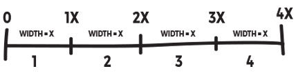

# Hover based stop motion

Move the mouse horizontally to show different pictures.

<a href="https://www.youtube.com/watch?v=0YpIhpSlIvY">Watch a demo video of the interaction.</a>

I used this diagram to figure out how to split the screen into horizontal "bands".



Each band is `x`wide, so I call this variable `bW` for band width. 

I can grab the mouse's x position with the processing variable `mouseX`.

I'll need a `counter` variable to keep track of how many photos I have. *It would be better if this was a function that counted the number of files in the data directory.*

I can use a for loop to increment through the multiples of `bW` up until the counter. So...

* if `0x < m =< 1x` *(i.e. mouse is in the first band)*, then show photo1.jpg
* if `1x < m =< 2x` *(i.e. mouse is in the second band)*, then show photo2.jpg;
* if `2x < m =< 3x` *(i.e. mouse is in the third band)*, then show photo3.jpg;
* and so on, until the counter resets... 

Here's a rough sketch of the program. See the code for the working version! 
```
	// first load all the images
	
	int counter = 20; // change this to number of image files
	int m = mouseX;
	int bW = windowWidth / counter-1; 
	int k = 0; // declare a constant, for previous value of i
	
	for (i = 1; i < counter; i++) {
		if (k < m && m <= i) {
			// show image i
		}
		k = i; // set k to i
	}
```


